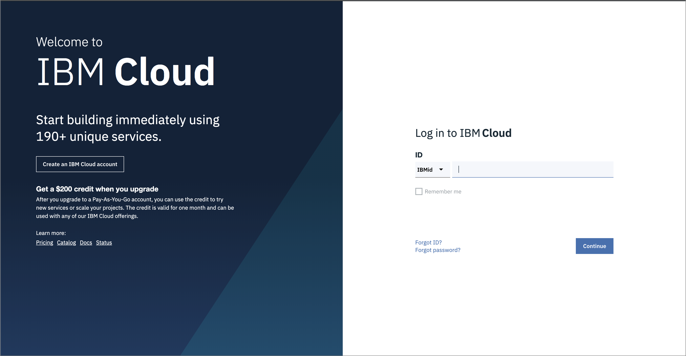

# Pre-work

This section is broken up into the following steps:

1. [Sign up for IBM Cloud](pre-work.md#1-sign-up-for-ibm-cloud)
2. [Download or clone the repo](pre-work.md#2-download-or-clone-the-repo)

## 1. Sign up for IBM Cloud

Ensure you have an IBM Cloud ID



## 2. Configure Workshop Environment

To do this workshop, you will need:

* ibmcloud cli tool.
* docker

You can install those tools to your workspace or you can use preconfigured workspace bound to your account. 

* **Sign Up to CognitiveClass Lab Environment**
* **Sign Up to Play with Docker Environment\***
* **Sign Up to Katacoda Environment**

### Sign Up to CognitiveClass Lab Environment

1. Go to [https://labs.cognitiveclass.ai](https://labs.cognitiveclass.ai) link and click to **CognitiveClass** button
2. Then click to **IBMid** button
3. It will open create account page with your information. Click to create account.
4. Then click to **Theia — Cloud IDE \(With Docker\)**
5. Click to Terminal menu and click to New Terminal


In Theia workspace environment, `ibmcloud dev build` command does not work due to permission issues.


```text
ibmcloud config --usage-stats-collect
ibmcloud plugin update --all
unset IBMCLOUD_API_KEY
ibmcloud login -a cloud.ibm.com -r eu-gb -g Default
```

### Sign Up to Play with Docker Environment


To use this preconfigured docker environment, you need a [Docker Hub](https://hub.docker.com) account.


1. Go to [https://labs.play-with-docker.com/](https://labs.play-with-docker.com/)
2. Click Login button and login with you docker hub account
3. Click Start to open your dashboard
4. Click to **add new instance** button on left menu to open a new session.

```text
docker run -d -t -v /var/run/docker.sock:/var/run/docker.sock -v $PWD:/userpath --name ibm-cloud-cli volaka/ibm-cloud-cli
docker exec -it ibm-cloud-cli bash
ibmcloud config --usage-stats-collect false
ibmcloud plugin update --all
ibmcloud login -a cloud.ibm.com -r eu-gb -g Default

```

```
ibmcloud target --cf
```

### OR Install IBMCLOUD CLI Directly! \(RECOMMENDED\)

```text
curl -fsSL https://clis.cloud.ibm.com/install/linux | sh
ibmcloud --help
```

### Sign Up to Katacoda Environment




