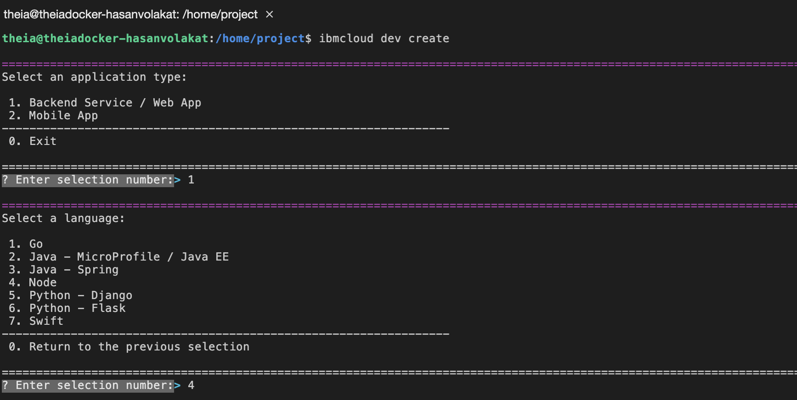
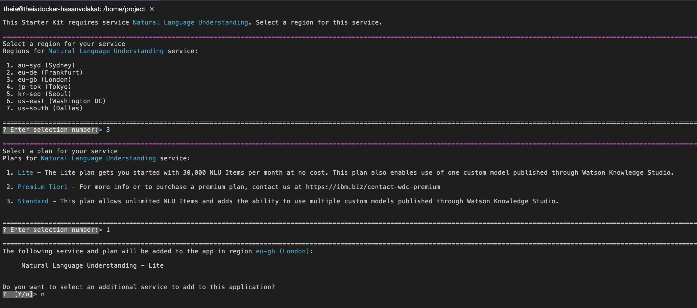
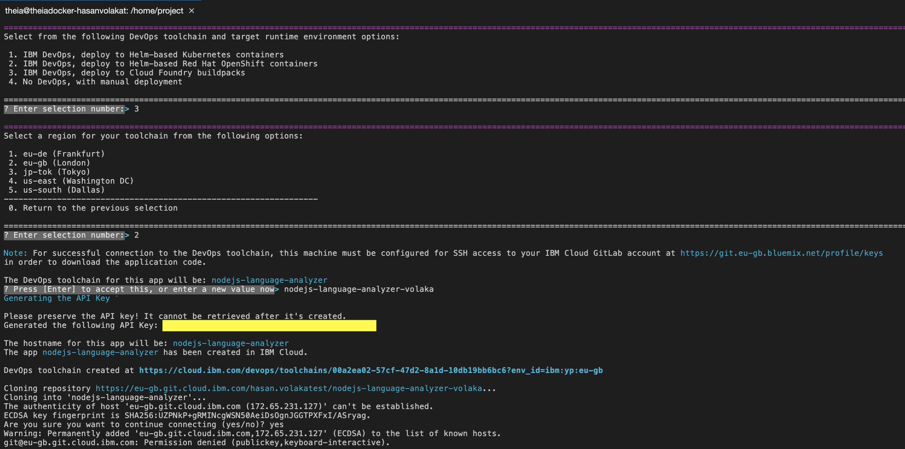
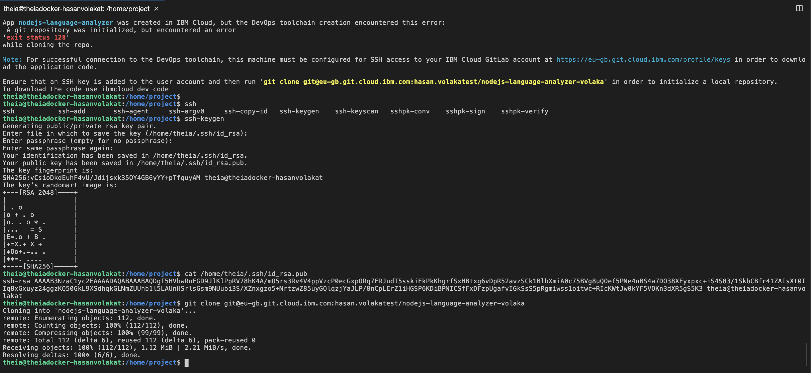

# Create Application

## Steps

```text
ibmcloud dev create
```

1. Select `Backend Service / Web App (1)`
2. Select `Node (4)`
3. Select `Natural Language Understanding Node.js App (4)`
4. Enter a name for your application
5. Select a region for your service - `eu-gb (London) (3)`
6. Select a plan for your service - `Lite (1)`
7. Do you want to select an additional service to add to this application? - `No`
8. Select `IBM DevOps, deploy to Cloud Foundry buildpacks`
9. Select a region for your toolchain from the following options: `eu-gb`
10. The DevOps toolchain for this app will be: &lt;your-app-name&gt;: Press enter
11. Copy your api key
12. Enter hostname

#### For Local workspace you can create an SSH key


For Play with Docker, you should use access token. You can see how you create it below SSH guide


1. Go to [https://eu-gb.git.cloud.ibm.com/profile/keys](https://eu-gb.git.cloud.ibm.com/profile/keys)

```text
ssh-keygen
```

1. Let the name as is
2. `cat /home/theia/.ssh/id_rsa.pub`
3. Copy the output
4. Paste it to ssh key area in [https://eu-gb.git.cloud.ibm.com/profile/keys](https://eu-gb.git.cloud.ibm.com/profile/keys)
5. Now clone your app to workspace using the git clone command created for you

```text
git clone git@eu-gb.git.cloud.ibm.com:<your-username>/<your-app-name>
cd <your-app-name>
```

#### For Play wit Docker, you can create user access token



* Select **api** checkbox, and click to create.
* Copy the user access token 
* Go to your projects from upper menu
* Select your project
* Click to clone and copy the **Clone with HTTPS** link.










